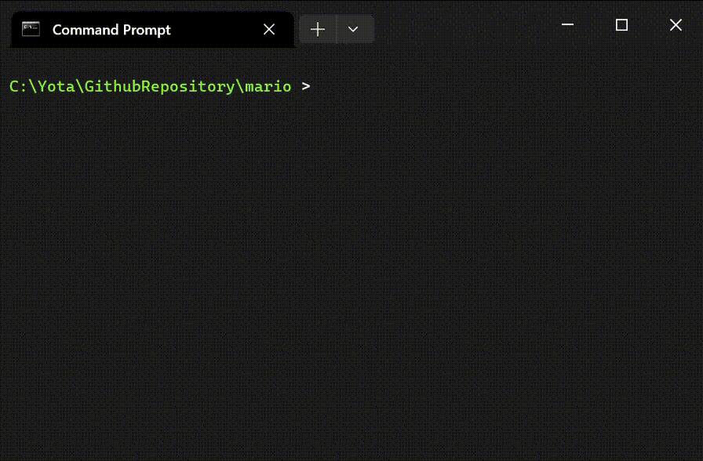

# Mario runs in your terminal.
This is a tiny C program which allows you to let Mario run in your terminal.


It is inspired by SL command.
__There is no use typing CTRL-C while Mario is running because it does not stop the program but stops Mario for 2sec.__

---

# Usage
```bash
# standard mode
mario

# fast mode (Mario runs very fast!)
mario -f

# stop mode (Mario stops for 2sec at the center of the terminal screen)
mario -s
```

# Build Requirements
- gcc
- make
- curses (or pdcurses if your OS is Windows)
